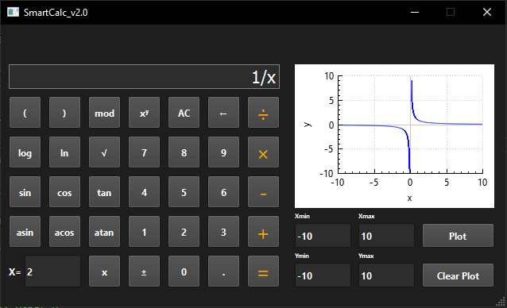

# SmartCalc v.2.0-0

> Проект калькулятора с использованием Qt

Для компиляции необходимо установить qmake

> sudo apt-get install qt6-base-dev qt6-declarative-dev

Запуск компиляции

> make install

Для запуска тестов и вывода отчета

> make gcov_report

Проверка на стилевые нормы

> make style
